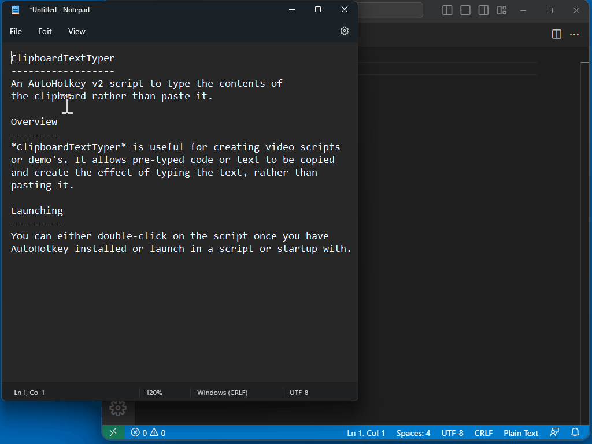

# ClipboardTextTyper
An AutoHotkey v2 script to type the contents of the clipboard rather than paste it.

## Overview

*ClipboardTextTyper* is useful for creating video scripts or demo's. It allows pre-typed code or text to be copied and create the effect of typing the text, rather than pasting it.



## Launching 

You can either double-click on the script once you have AutoHotkey installed or launch in a script or startup with.

```
AutoHotkey.exe CipBoardTextTyper.ahk <subDocDelimiter> <showMessages> <playSounds>
```
|Parameter|Description|Default|
|---------|-----------|-------|
|*subDocDelimiter*|The character that seperates sub-documents in the clipboard|¬|
|*showMessages*|Whether to show or surpress script messages|On| 
|*playSounds*|Whether to play startup and exit sounds|On|

## Example

Run the script with the delimeter set to `#` and suppress script messages. Sounds will be played. From Powershell:

``` pwsh
& 'C:\Program Files\AutoHotkey\v2\AutoHotkey.exe' .\CipboardTextTyper.ahk ¬ Off On
``` 
## Usage

Once the script has been launched it can be controlled with the following keys:-

|Keys|Description|
|----|-----------|
|*Ctrl+Shift+T*|Activates ClipboardTextTyper|
|*Ctrl+Shift+Escape*|De-activates ClipBoardTextTyper|
|*Ctrl+Shift+V*|Types the next sub-document|
|*Ctrl+Shift+UpArrow*|Moves backwards to the previous sub-document in the clipboard|
|*Ctrl+Shift+DownArrow*|Moves forwards to the next sub-document in the clipboard|
|*Ctrl+Shift+LeftArrow*|Decreases the typings speed|
|*Ctrl+Shift+RightArrow*|Increases the typings speed|
|*Ctrl+Shift+M*|Toggles tooltip messages on and off|
|*Ctrl+Shift+S*|Toggles sound effects on and off|

## Sub-documents

The text that you copy can contain a special delimeter to create multiple sub-documents to type. When the delimeter is reached *ClipboardTextTyper* will pause typing and wait for the next `Ctrl+Shift+V` keypress before typing the next sub-document.

```
This will type on the first <Ctrl+Shift+V> press
¬This will type on the second <Ctrl+Shift+V> press
¬This will type on the third <Ctrl+Shift+V> press
```

In the above example the default delimeter `¬` is used.

## Macros

You can make full use of the AutoHotkey automation features and invoke control key sequences, mouse clicks and navigational keys. 

Start the sub-document with `{macro}` immediately after the delimeter. This example will type the first two lines after two `Ctrl+Shift+V` presses and will backspace 116 times and press `Ctrl+S` (*^s* in AutoHotkey lingo).

```
This sentence will be typed when the first Ctr+Shift+V is pressed

¬And this will be typed when the second Ctr+Shift+V is pressed.
It will be deleted by the macro on the next line.

¬{macro}{BS 116}
¬{macro}^s
```

For a full list of supported keynames and features refer to the [AutoHotkey Keynames reference](https://www.autohotkey.com/docs/v2/lib/Send.htm#keynames).

## Specifying options on the Clipboard 

You can also specify options for *ClipboardTextTyper* in the first line of the text being copied. Options can be specified as follows and should appear on a line of its own at the top of the text being copied. 

```
{options delimeter=|,messages=off,sounds=on}
This is sub-document one|
This is sub-document two|
This is sub-document three
```

In the example above the delimeter is set to `|`, tooltip messages are supressed and start and end sounds will be played. Typing will start from the first character on line two.

## Requirements

This script requires [AutoHotkey](https://www.autohotkey.com/) version 2. Please refer to the [online documentation](https://www.autohotkey.com/docs/) for more info. *AutoHotkey* currently only runs on Windows.
