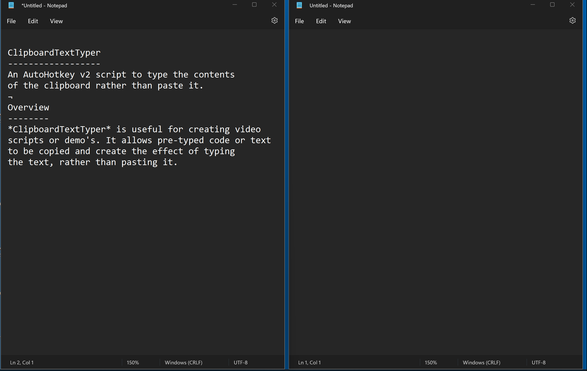

# ClipboardTextTyper
An AutoHotkey v2 script to type the contents of the clipboard rather than paste it.

## Overview

*ClipboardTextTyper* is useful for creating video scripts or demo's. It allows pre-typed code or text to be copied and create the effect of typing the text, rather than pasting it.



## Launching 

You can either double-click on the script once you have AutoHotkey installed or launch in a script or startup with.

```
AutoHotkey.exe CipBoardTextTyper.ahk <subDocDelimiter> <showMessages> <playSounds>
```
|Parameter|Description|Default|
|---------|-----------|-------|
|*subDocDelimiter*|The character that seperates sub-documents in the clipboard|¬|
|*showMessages*|Whether to show or surpress script messages|true| 
|*playSounds*|Whether to play startup and exit sounds|true|

## Example

Run the script with the delimeter set to `#` and suppress script messages. Sounds will be played. From Powershell:

``` pwsh
& 'C:\Program Files\AutoHotkey\v2\AutoHotkey.exe' .\CipboardTextTyper.ahk ¬ false true
``` 
## Usage

Once the script has been launched it can be controlled with the following keys:-

|Keys|Description|
|----|-----------|
|*Ctrl+Shift+T*|Activates ClipboardTextTyper|
|*Escape*|De-activates ClipBoardTextTyper|
|*Ctrl+Shift+V*|Types the next sub-document|
|*Ctrl+Shift+UpArrow*|Moves backwards to the previous sub-document in the clipboard|
|*Ctrl+Shift+DownArrow*|Moves forwards to the next sub-document in the clipboard|
|*Ctrl+Shift+LeftArrow*|Decreases the typings speed|
|*Ctrl+Shift+RightArrow*|Increases the typings speed|
|*Ctrl+Shift+M*|Toggles tooltip messages on and off|

## Sub Documents

The text that you copy can contain a special delimeter to create multiple sub-documents to tupe. When the delimeter is reached *ClipboardTextTyper* will pause typing and wait for the next `Ctrl+Shift+V` keypress before typing the next sub-document.

```
This will type on the first <Ctrl+Shift+V> press
¬
This will type on the second <Ctrl+Shift+V> press
¬
This will type on the third <Ctrl+Shift+V> press
```

In the above example the default delimeter `¬` is used.

## Requirements

This script requires [AutoHotkey](https://www.autohotkey.com/) version 2. Please refer to the [online documentation](https://www.autohotkey.com/docs/) for more info. *AutoHotkey* currently only runs on Windows.
